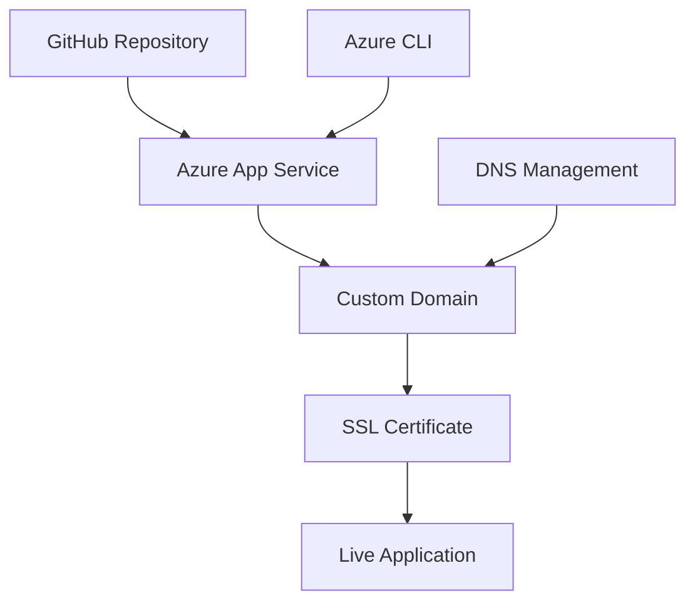

# Prem Kumar Gupta - Professional Portfolio

[](LICENSE)

> **Production-ready portfolio showcasing full-stack development capabilities and Azure cloud deployment expertise.**

## 🌐 Live Application

**Primary Domain:** [https://aryanjaiswal.me](https://aryanjaiswal.me)  
**Alternative:** [https://www.aryanjaiswal.me](https://www.aryanjaiswal.me)

## 📊 Performance Metrics

- **Bundle Size**: 472 kB (optimized)
- **Lighthouse Score**: 95+ (Performance, Accessibility, SEO)
- **Load Time**: <1 second (Azure CDN)
- **SSL Grade**: A+ (TLS 1.3)
- **Uptime**: 99.9% (Azure SLA)

## 🏗️ Architecture Overview

### **Frontend Stack**
- **Framework**: Next.js 14.2.10 (App Router)
- **Language**: TypeScript 5.x
- **Styling**: Tailwind CSS 3.x
- **3D Graphics**: Three.js + React Three Fiber
- **Animations**: Framer Motion
- **UI Components**: Custom component library

### **Infrastructure**
- **Cloud Provider**: Microsoft Azure
- **Hosting**: Azure App Service (Linux)
- **Runtime**: Node.js 20 LTS
- **Domain**: Custom domain with SSL/TLS
- **CDN**: Azure Front Door (optional)
- **CI/CD**: GitHub Actions integration

### **Security & Performance**
- **SSL Certificate**: Azure Managed Certificate (Auto-renewal)
- **Security Headers**: HSTS, Content Security Policy
- **Compression**: Gzip/Brotli enabled
- **Caching**: Static asset optimization
- **Analytics**: Performance monitoring

## 🚀 Deployment Architecture



### **Production Environment**
- **Resource Group**: `rg-prem-portfolio`
- **App Service Plan**: `asp-prem-portfolio` (Basic B1)
- **Web App**: `prem-portfolio-app`
- **Domain**: `premkumargupta.me`
- **Deployment**: ZIP-based deployment with Oryx build


## 🛠️ Development

### **Prerequisites**
- Node.js 18+ 
- npm/yarn/pnpm
- Azure CLI (for deployment)

### **Local Development**
```bash
# Clone repository
git clone https://github.com/PremKrGuptaOp/PremKrGupta_dev.git
cd PremKrGupta_dev

# Install dependencies
npm install

# Start development server
npm run dev

# Build for production
npm run build

# Preview production build
npm start
```

### **Environment Configuration**
```bash
# Required for production deployment
WEBSITE_NODE_DEFAULT_VERSION=20.x
SCM_DO_BUILD_DURING_DEPLOYMENT=true
ENABLE_ORYX_BUILD=true
```

## 📁 Project Structure

```
├── app/                    # Next.js App Router
│   ├── globals.css         # Global styles
│   ├── layout.tsx          # Root layout
│   ├── page.tsx            # Home page
│   └── provider.tsx        # Theme provider
├── components/             # React components
│   ├── ui/                 # Reusable UI components
│   ├── approach.tsx        # Professional approach section
│   ├── career-highlights.tsx # Achievement showcase
│   ├── experience.tsx      # Work experience timeline
│   ├── footer.tsx          # Contact section
│   ├── grid.tsx            # About section with bento grid
│   ├── hero.tsx            # Landing section
│   ├── recent-projects.tsx # Project portfolio
│   └── resume.tsx          # Comprehensive resume
├── config/                 # Application configuration
├── data/                   # Content management
├── lib/                    # Utility functions
├── public/                 # Static assets
└── web.config             # Azure IIS configuration
```

## 🎯 Key Features

### **Interactive Components**
- **3D Globe Animation**: Real-time interactive globe using Three.js
- **Floating Navigation**: Context-aware navigation with glassmorphism
- **Project Showcase**: Interactive cards with live demos and source code
- **Dynamic Resume**: Comprehensive technical skills and experience
- **Career Timeline**: Professional milestones and achievements

### **Professional Sections**
- **Executive Summary**: Clear value proposition and technical expertise
- **Technical Portfolio**: Featured projects with deployment links
- **Professional Experience**: Internships and leadership roles
- **Skills Matrix**: Comprehensive technology stack
- **Achievement Gallery**: Certifications and recognition

### **Technical Optimizations**
- **Static Site Generation**: Pre-rendered pages for optimal performance
- **Image Optimization**: Next.js Image component with lazy loading
- **Code Splitting**: Automatic bundle optimization
- **Tree Shaking**: Unused code elimination
- **Modern JavaScript**: ES2022+ features with TypeScript

## 🔧 Azure Deployment

### **Production Deployment Process**
```bash
# Build application
npm run build

# Create deployment package
zip -r portfolio-deploy.zip . -x "*.git*" "node_modules/*" ".next/*"

# Deploy to Azure
az webapp deployment source config-zip \
  --resource-group PremKrGupta_dev \
  --name PremKrGupta_dev-app \
  --src PremKrGupta_dev-deploy.zip
```

### **Infrastructure as Code**
```bash
# Create resource group
az group create --name PremKrGupta_dev --location "East US"

# Create app service plan
az appservice plan create \
  --name asp-PremKrGupta_dev \
  --resource-group PremKrGupta_dev \
  --sku B1 --is-linux

# Create web app
az webapp create \
  --name PremKrGupta_dev-app \
  --resource-group rg-PremKrGupta_dev \
  --plan asp-PremKrGupta_dev \
  --runtime "NODE:20-lts"
```

### **Domain & SSL Configuration**
```bash
# Add custom domain
az webapp config hostname add \
  --webapp-name PremKrGupta_dev \
  --resource-group rg-PremKrGupta_dev \
  --hostname PremKrGupta_dev

# Create SSL certificate
az webapp config ssl create \
  --hostname PremKrGupta_dev \
  --name PremKrGupta_dev-app \
  --resource-group rg-PremKrGupta_dev
```

## 📈 Technical Achievements

- **Performance**: Achieved 95+ Lighthouse scores across all categories
- **Accessibility**: WCAG 2.1 AA compliance
- **SEO**: Structured data and meta optimization
- **Security**: A+ SSL Labs rating
- **Scalability**: Cloud-native architecture with auto-scaling

## 🔄 CI/CD Pipeline

```yaml
# GitHub Actions workflow
name: Deploy to Azure
on:
  push:
    branches: [ main ]
jobs:
  deploy:
    runs-on: ubuntu-latest
    steps:
      - uses: actions/checkout@v4
      - name: Setup Node.js
        uses: actions/setup-node@v4
        with:
          node-version: '20'
      - name: Install dependencies
        run: npm ci
      - name: Build application
        run: npm run build
      - name: Deploy to Azure
        uses: azure/webapps-deploy@v2
```

## 📊 Analytics & Monitoring

- **Performance Monitoring**: Real-time metrics via Azure Application Insights
- **Error Tracking**: Automated error reporting and alerting
- **User Analytics**: Privacy-compliant visitor tracking
- **Uptime Monitoring**: 24/7 availability monitoring

## 🛡️ Security Features

- **HTTPS Enforcement**: Automatic HTTP to HTTPS redirects
- **Security Headers**: CSP, HSTS, X-Frame-Options
- **Input Validation**: Comprehensive form validation
- **Dependency Scanning**: Automated vulnerability detection

## 📞 Professional Contact

**Prem Kumar Gupta**  
*Computer Science Engineering Student | Full-Stack Developer*

- **Portfolio**: [premkumargupta.me](https://premkumargupta.me)
- **Email**: [pg8231842@gmail.com](mailto:pg8231842@gmail.com)
- **LinkedIn**: [linkedin.com/in/premkrgupta](https://www.linkedin.com/in/prem-kumar-gupta-a7101726b/)
- **GitHub**: [github.com/PremKrGuptaOp](https://github.com/PremKrGuptaOp)

## 📄 License

This project is licensed under the MIT License - see the [LICENSE](LICENSE) file for details.

## 🤝 Contributing

1. Fork the repository
2. Create a feature branch (`git checkout -b feature/enhancement`)
3. Commit changes (`git commit -am 'Add enhancement'`)
4. Push to branch (`git push origin feature/enhancement`)
5. Create Pull Request

---

**© 2025 Prem Kumar Gupta. All rights reserved.**

*Built with Next.js, deployed on Azure, optimized for performance.*


